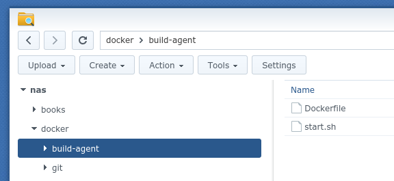
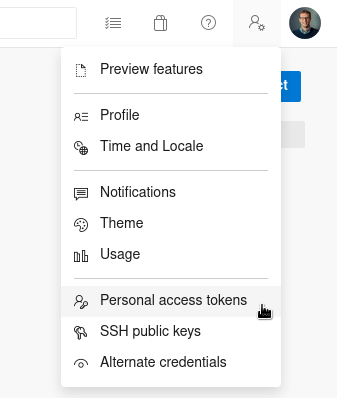
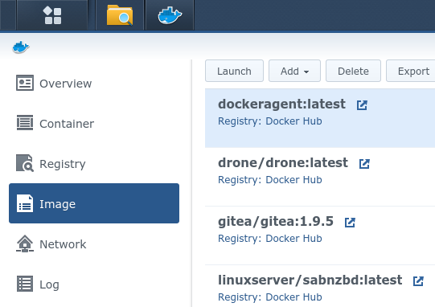
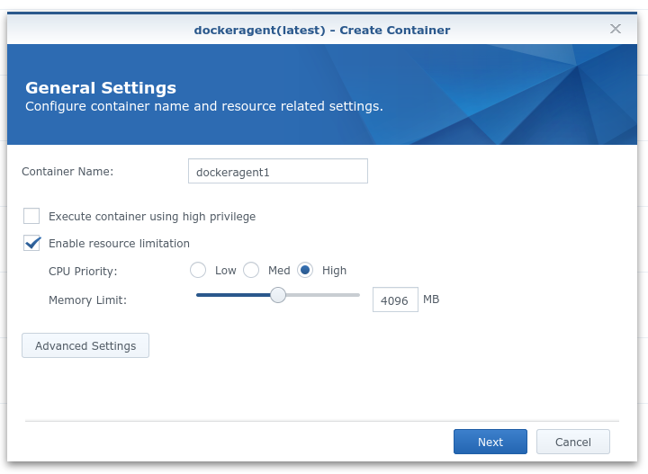
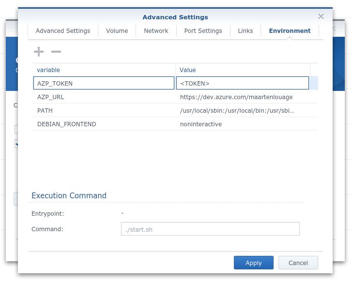
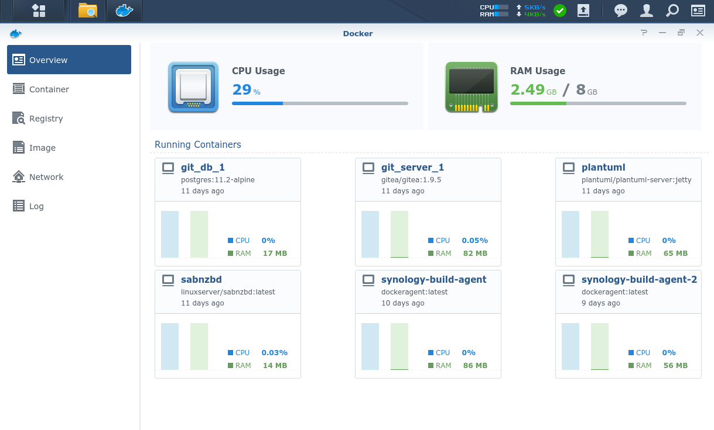
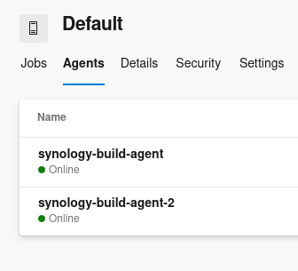
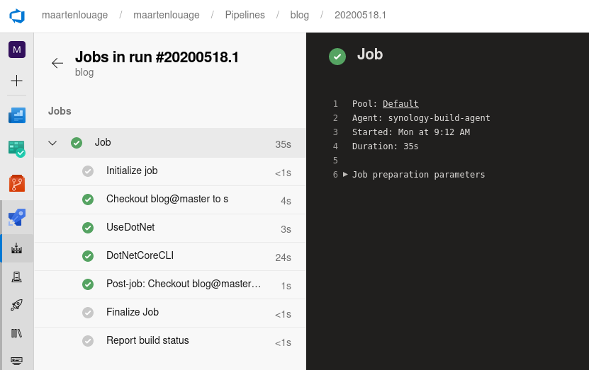

Azure DevOps is voor ons de belangrijkste service om werk te plannen, samen te programmeren en applicaties te builden en te deployen. Om deze applicaties te builden heeft Microsoft gratis resources beschikbaar gesteld, per maand kan je gebruikmaken van 1800 minuten om je applicaties te builden. Dat lijkt veel maar eens je volledig inzet op het continuous integration/continuous deployment (CI/CD) principe dan verdwijnen deze minuten als sneeuw voor de zon. Omdat we uiteraard goede principes zoals CI/CD niet graag opzij zetten om build minuten te sparen geven we hieronder een overzicht wat de opties zijn om zowel CI/CD te ontwikkelen en toch de kosten wat in de hand te houden.

Er zijn eigenlijk twee opties: je koopt extra resources bij Microsoft of je richt zelf een build agent in om onbeperkt je code te kunnen builden. De pricing van Microsoft kan soms redelijk onoverzichtelijk overkomen dus daarom een korte samenvatting. Microsoft maakt een onderscheid tussen Private projects en Public projects. Het draait bij beide opties voornamelijk om de parallelle builds die je kan uitvoeren. Om te beginnen met de Private projects, dat is toch nog wat bij grote klanten het meeste voorkomt. Je krijgt de mogelijkheid om gebruik te maken van de Microsoft-hosted build agent voor 1800 minuten en 1 parallelle build. Daarnaast mag je 1 self-hosted build agent met een onbeperkt aantal minuten toevoegen aan het project. Hebben de gebruikers van je project een Visual Studio Enterprise licentie dan heb je de mogelijkheid om per gebruiker 1 self-hosted build agent toe te voegen. Public projects hebben een ruimere marge: die krijgen van Microsoft 10 parallelle builds met een onbeperkt aantal minuten en ook gelijk de mogelijkheid om een onbeperkt aantal self-hosted agents toe te voegen.

Bijvoorbeeld, ik heb een private project met 3 gebruikers en 2 van deze gebruikers hebben een Visual Studio Enterprise licentie, de derde heeft een Visual Studio Professional licentie. Wat ik maximaal tot mijn beschikking heb zonder bij te betalen is het volgende:

|Soort|Aantal|Aantal minuten|
|----------|----------|----------|
|Microsoft-hosted|1|1800|
|Self-hosted|2|Onbeperkt|

Er kunnen dus 3 builds tegelijk uitgevoerd worden, tot de 1800 minuten van de Microsoft-hosted build agent op zijn, dan vallen we terug op 2 parallelle builds.

Waarom zijn de parallelle builds zo belangrijk? Zeker met het CI principe wil je iedere developer de mogelijkheid geven om te kijken of zijn code wel build op de build agents. Parallelle builds zie je ook terug bij het gebruik van pull requests (PR), we willen dat er eerst een succesvolle build wordt afgerond vooraleer de code gemerged kan worden naar master.

Stel, je build duurt 10 minuten -wat niet heel gek is- en je bent met 3 developers met een Visual Studio Enterprice licentie. Je hebt niet van de mogelijkheid gebruik gemaakt om self-hosted build agents toe te voegen, je hebt alleen de Microsoft-hosted build agent en deze wel uitgebreid dat er na de 1800 gratis minuten betaald voor wordt zodat er steeds gebuild kan worden, dat kost je net geen 34 EUR/maand. Elke developer gaat een PR aanmaken, de eerste developer heeft geluk, zijn PR begint meteen met builden. Na ongeveer 6 minuten maakt developer #2 een PR aan. Er moet nu nog 4 minuten worden gewacht vooraleer de build wordt gestart. Nog eens 5 minuten later maakt developer #3 een PR aan, hij maakt maar een kleine wijziging. De build van developer #2 duurt nog 9 minuten vooraleer de build van developer #3 begint. Ondertussen is de build van developer #1 afgelopen en geslaagd en hij wil zijn code nu doortzetten naar de master branch. Hierdoor wordt de build van developer #2 die ondertussen ook afgelopen is als niet geldig aangemerkt omdat de code op master is gewijzigd, er moet opnieuw worden geintegreerd vooraleer de code van developer #2 naar master kan worden doorgezet...

Je merkt het al, de tijd die het duurt stapelt zich op en werkt in het nadeel van de productiviteit van de developers. De oplossing is eigenlijk simpel, als iedere developer gebruik maakt van de mogelijkheid om een self-hosted build toe te voegen, worden de wachttijden enorm verkort. 

Door de self-hosted build agent als een Docker container te draaien creëer je nog meer flexibiliteit: je eigen krachtige developer laptop, zoals we die bij XPRTZ zelf mogen uitkiezen, wordt op die manier onderdeel van Azure DevOps zonder dat je bepaalde SDK's of andere tooling moet installeren. In dit voorbeeld heb ik gekozen om extra self-hosted build agents toe te voegen voor mijn hobby projecten. Deze kan ik b.v. draaien op een Synology NAS met Docker-ondersteuning. De NAS staat toch 24/7 aan dus die extra CPU cores komen wel van pas! Zoals eerder vermeld, de Docker containers kan je ook draaien op je laptop, desktop of een VPS in de cloud. De Synology NAS draait op Linux dus dat wil zeggen dat mijn eigen build agent ook een Linux build agent wordt: ik kan hiermee perfect dotnet core projecten builden en frontend projecten die gebruik maken van Angular, React of Vue om er maar een paar te noemen.

## Bouwen van de Docker image

- Ik maak op mijn NAS eerst de gewenste mapstructuur en bestanden aan. Ik heb een Dockerfile nodig en een start.sh. Beide bestanden zijn ook te vinden in de bijhorende [Github repository](https://github.com/XPRTZ/selfhosted-build-agent-docker).



### Dockerfile

```docker
FROM ubuntu:18.04

ENV DEBIAN_FRONTEND=noninteractive
RUN echo "APT::Get::Assume-Yes \"true\";" > /etc/apt/apt.conf.d/90assumeyes

RUN apt-get update \
&& apt-get install -y --no-install-recommends \
        ca-certificates \
        curl \
        jq \
        git \
        iputils-ping \
        libcurl4 \
        libicu60 \
        libunwind8 \
        netcat

WORKDIR /azp

COPY ./start.sh .
RUN chmod +x start.sh

CMD ["./start.sh"]
```

### start.sh

```bash
#!/bin/bash
set -e

if [ -z "$AZP_URL" ]; then
  echo 1>&2 "error: missing AZP_URL environment variable"
  exit 1
fi

if [ -z "$AZP_TOKEN_FILE" ]; then
  if [ -z "$AZP_TOKEN" ]; then
    echo 1>&2 "error: missing AZP_TOKEN environment variable"
    exit 1
  fi

  AZP_TOKEN_FILE=/azp/.token
  echo -n $AZP_TOKEN > "$AZP_TOKEN_FILE"
fi

unset AZP_TOKEN

if [ -n "$AZP_WORK" ]; then
  mkdir -p "$AZP_WORK"
fi

rm -rf /azp/agent
mkdir /azp/agent
cd /azp/agent

export AGENT_ALLOW_RUNASROOT="1"

cleanup() {
  if [ -e config.sh ]; then
    print_header "Cleanup. Removing Azure Pipelines agent..."

    ./config.sh remove --unattended \
      --auth PAT \
      --token $(cat "$AZP_TOKEN_FILE")
  fi
}

print_header() {
  lightcyan='\033[1;36m'
  nocolor='\033[0m'
  echo -e "${lightcyan}$1${nocolor}"
}

# Let the agent ignore the token env variables
export VSO_AGENT_IGNORE=AZP_TOKEN,AZP_TOKEN_FILE

print_header "1. Determining matching Azure Pipelines agent..."

AZP_AGENT_RESPONSE=$(curl -LsS \
  -u user:$(cat "$AZP_TOKEN_FILE") \
  -H 'Accept:application/json;api-version=3.0-preview' \
  "$AZP_URL/_apis/distributedtask/packages/agent?platform=linux-x64")

if echo "$AZP_AGENT_RESPONSE" | jq . >/dev/null 2>&1; then
  AZP_AGENTPACKAGE_URL=$(echo "$AZP_AGENT_RESPONSE" \
    | jq -r '.value | map([.version.major,.version.minor,.version.patch,.downloadUrl]) | sort | .[length-1] | .[3]')
fi

if [ -z "$AZP_AGENTPACKAGE_URL" -o "$AZP_AGENTPACKAGE_URL" == "null" ]; then
  echo 1>&2 "error: could not determine a matching Azure Pipelines agent - check that account '$AZP_URL' is correct and the token is valid for that account"
  exit 1
fi

print_header "2. Downloading and installing Azure Pipelines agent..."

curl -LsS $AZP_AGENTPACKAGE_URL | tar -xz & wait $!

source ./env.sh

trap 'cleanup; exit 130' INT
trap 'cleanup; exit 143' TERM

print_header "3. Configuring Azure Pipelines agent..."

./config.sh --unattended \
  --agent "${AZP_AGENT_NAME:-$(hostname)}" \
  --url "$AZP_URL" \
  --auth PAT \
  --token $(cat "$AZP_TOKEN_FILE") \
  --pool "${AZP_POOL:-Default}" \
  --work "${AZP_WORK:-_work}" \
  --replace \
  --acceptTeeEula & wait $!

# remove the administrative token before accepting work
rm $AZP_TOKEN_FILE

print_header "4. Running Azure Pipelines agent..."

# `exec` the node runtime so it's aware of TERM and INT signals
# AgentService.js understands how to handle agent self-update and restart
exec ./externals/node/bin/node ./bin/AgentService.js interactive
```

- Nu moeten we de Docker image builden. Daarvoor log ik eerst in via SSH op de NAS, navigeer naar de aangemaakte map en voer het volgende commando uit:

```bash
sudo docker build -t dockeragent:latest .
```

- De self-hosted build agents moeten via een URL en een TOKEN gekoppeld worden aan de juiste Azure DevOps organisatie. Hiervoor moet je eerst een nieuw Personal access token (PAT) aanmaken. Klik in Azure DevOps op User Settings -het icoontje links van je profielfoto- en kies Personal access tokens. Genereer hier een nieuw token. Bewaar het token, dit heb je nodig om als environment variable aan de container mee te geven.



- Nu kunnen we verder in de webinterface die Synology aanbiedt om Docker containers te beheren, start deze op kies voor Image.



- Selecteer de nieuwe image Dockeragent en klik op Launch.



- Ik kies ervoor om de CPU priority op High te zetten en als geheugen limiet geef ik 4096MB op. Kies hier een limiet dat past bij je NAS, mijn NAS heeft 8GB geheugen. Dit geheugen wordt niet meteen gereserveerd wanneer de container start maar is wat de container maximaal mag gebruiken.

- Voeg bij Advanced settings nog de twee extra environment variables AZP_URL en AZP_TOKEN in met hun bijhorende waardes en doorloop daarna de wizard.



- De container wordt gestart en na een tijdje zie je die verschijnen in Azure DevOps in de default pool. Wil je dat de agents in een bepaalde pool terecht komen dan kan je nog een extra environment variable meegeven AZP_POOL met als de waarde de naam van de pool. Ik heb 2 containers gestart in dit voorbeeld.

Synology NAS



Azure DevOps



## Resultaat

Ik maak een nieuwe repository aan in mijn Azure DevOps project en  genereer een standaard ASP.NET Core MVC applicatie. Ik voeg onderstaande Yaml pipeline toe om het project te bouwen:

```yaml
trigger:
- master

pool: Default

variables:
  buildConfiguration: 'Release'

steps:
- task: UseDotNet@2
  inputs:
    packageType: 'sdk'
    version: '3.1.x'
- task: DotNetCoreCLI@2
  inputs:
    command: 'build'
    projects: '**/*.csproj'
    workingDirectory: '$(System.DefaultWorkingDirectory)'
```

Wanneer de builds starten maken ze nu gebruik van mijn eigen self-hosted build agent op mijn NAS. 



De hele job wordt in 35 seconden afgerond. Niet slecht voor een klein doosje in mijn meterkast!